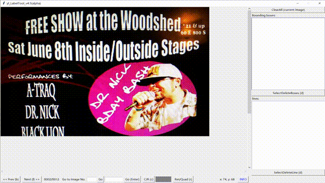

# Semantic Boundary Estimation(SBE)

This project will release the semi-automatic annotation tools for curve text detection. The backend of the tools is the algorithm proposed in our paper:
> A New Semi-Automatic Annotation Model via Semantic Boundary Estimation for Scene Text Detection  

The tool will be released soon. Please stay tuned.

## Abstract

### about paper 

Manually annotating a data set for scene text detection is extremely time-consuming. In this paper, we propose a new semi-automatic annotation model to produce tight polygonal annotations for text instances in scene images, based on the input of manually annotated text center lines. Our approach first generates multiple candidate boundaries, which share the same input center line. Then, by training a fastidious content recognizer, optimal boundary selection is performed. The bounded text region, which achieves the smallest recognition loss, is selected as the tightest of the text. As this optimal boundary estimation is guided by semantic recognition, our method is called Semantic Boundary Estimation. Experiment results show that only half clicks compared to manually annotated polygon, are input to annotate center line, and precise polygon text region annotation is automatically produced. A high recall of more than 95% at IoU>0.5 and 80% at IoU>0.7 is achieved, demonstrating the high agreement with the original ground truth. In addition, using the generated annotations on benchmarks, such as Total-Text, CTW1500 and ICDAR2015, to train state-of-the-art detectors can achieve similar performance to those trained with manual annotations. This further verifies the good annotation performance. A annotation toolkit based on the proposed model will be available here.

### about tools

The demo annotation tool is developed from the manual tool in [Liu](https://github.com/Yuliang-Liu/Curve-Text-Detector/tree/master/data). And the tool has three annotating modes:
* Polygon mode: Manual annotation mode the same as [Liu](https://github.com/Yuliang-Liu/Curve-Text-Detector/tree/master/data). User needs to annotate all vetice of the polygonal outline.
* Center-Line Mode with Transcriptions: Users need annotating the text center line and the text content for every text instance. And the SBE will produce the region of high by using the semantic in text content.
* Center-Line Mode without Transcriptions: Users need only annotating the text center line for every text instance. And the SBE will produce the region of high quality by using the estimated semantic.

We will eventually develop our tool based on the [Coco-Annotator](https://github.com/jsbroks/coco-annotator).

## Visualization

Here are some visualization of the demo tool.

### Different Mode
* Polygon Mode

<table>
    <tr>
        <td width="30%">
    
        </td>   
        <td width="30%">
	
        </td>   
        <td width="30%">
	
        </td> 
    </tr>
</table>

* Center-Line Mode with Transcriptions

<table>
    <tr>
        <td width="30%">
	
        </td>   
        <td width="30%">
	
        </td>   
        <td width="30%">
	
        </td> 
    </tr>
</table>

* Center-Line Mode without Transcriptions

<table>
    <tr>
        <td width="30%">
	
        </td>   
        <td width="30%">
	
        </td>   
        <td width="30%">
	
        </td> 
    </tr>
</table>

### Annotation For Irregular Text

<table>
    <tr>
        <td width="30%">
	
        </td>   
        <td width="30%">
	
        </td>   
        <td width="30%">
	
        </td> 
    </tr>
</table>

## Citations
Please consider citing our papers in your publications if it helps your research. 
