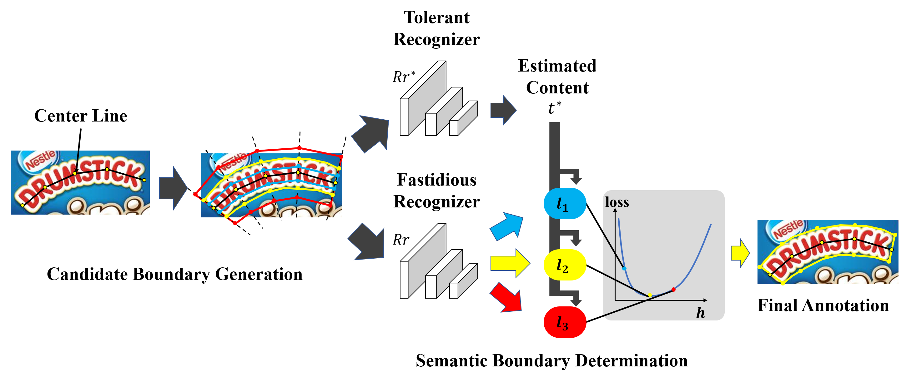

# Semantic Boundary Discrimintation NetWorks(SBDNet)
This project will release the semi-automatic annotation tools for curve text detection. The backend of the tools is the algorithm proposed in our paper:
> Toward more efficient annotation algorithm for Text Detection via semantic Boundary Discrimination  
> authors(e.g. Shiyin Zhang, Jun Hao Liew, Yunchao Wei, Shikui Wei, Yao Zhao)

The tool will be released soon. Please stay tuned.

### Abstract
This tool help to harvest precise curve text location, with minimized the human interaction cost. To achieve this, we propose the Semantic Boundary Discrimintation NetWorks(SBDNet) approach in this work. The SBDNet model takes the text center line, which is easier to annotate, as input, and produces text region of high quality automatically. 

The tool developed from the manual tool in [link](https://github.com/Yuliang-Liu/Curve-Text-Detector/tree/master/data). And Our tool has three annotating modes:
* Polygon mode: Manual annotation mode the same as [link](https://github.com/Yuliang-Liu/Curve-Text-Detector/tree/master/data).
* Center-Line Mode with Transcriptions: Users need annotating the text center line and the text content for every text instance. And the SBDNet will produce the region of high by using the semantic in text content.
* Center-Line Mode without Transcriptions: Users need only annotating the text center line for every text instance. And the SBDNet will produce the region of high quality by using the estimated semantic.

### Visualization

Here are some visualization of our tool. The binary file of our tool will be released soon.

#### Different Mode
* Polygon Mode

<table>
    <tr>
        <td width="30%">
    
        </td>   
        <td width="30%">
	
        </td>   
        <td width="30%">
	
        </td> 
    </tr>
</table>

* Center-Line Mode with Transcriptions

<table>
    <tr>
        <td width="30%">
	
        </td>   
        <td width="30%">
	
        </td>   
        <td width="30%">
	
        </td> 
    </tr>
</table>

* Center-Line Mode without Transcriptions

<table>
    <tr>
        <td width="30%">
	
        </td>   
        <td width="30%">
	
        </td>   
        <td width="30%">
	
        </td> 
    </tr>
</table>

#### Annotation For Irregular Text

<table>
    <tr>
        <td width="30%">
	
        </td>   
        <td width="30%">
	
        </td>   
        <td width="30%">
	
        </td> 
    </tr>
</table>

### Citations
Please consider citing our papers in your publications if it helps your research. The following is a BibTeX reference.

    <!-- @inproceedings{zhang2020interactive,
      title={Interactive Object Segmentation With Inside-Outside Guidance},
      author={Zhang, Shiyin and Liew, Jun Hao and Wei, Yunchao and Wei, Shikui and Zhao, Yao},
      booktitle={Proceedings of the IEEE/CVF Conference on Computer Vision and Pattern Recognition},
      pages={12234--12244},
      year={2020}
    } -->
