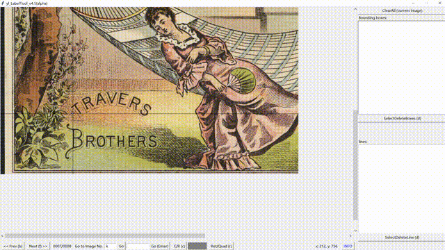

# Semantic Boundary Estimation(SBE)

This project will release the semi-automatic annotation tools for curve text detection. The backend of the tools is the algorithm proposed in our paper:
> A New Semi-Automatic Annotation Model via Semantic Boundary Estimation for Scene Text Detection  

The tool will be released soon. Please stay tuned.

## Abstract

### about paper 

Manually annotating dataset for scene text detection is extremely time consuming. In this paper, we propose a new semi-automatic annotation model, i.e., Semantic Boundary Estimation (SBE), to automatically produce a tight polygonal annotation for the text instance in a scene image, just taking as input a manual-annotated text center line. In particular, our approach first generates multiple candidate boundaries sharing the same input center-line. Then using a fastidious content recognizer specially trained performs optimal boundary selection. When the bounded text region gets the smallest recognition loss, we grant the corresponding boundary as the tightest one surrounding text. As this optimal boundary estimation is guided by semantic recognition, we call the method Semantic Boundary Estimation. Experiment results show that only half clicks are input to annotate center line, precise polygon text region annotation is automatically produced. A high recall of more than 95% at IoU>0.5 and 80% at IoU>0.7 is achieved, demonstrating the agreement with the original ground truth. In addition, using the generated annotations on benchmarks Total-Text, CTW1500 and ICDAR2015 to train state-of-the-art detectors achieve similar performance to those trained with manual annotations, which further verifies the good annotation performance.

### about tools

The tool developed from the manual tool in [link](https://github.com/Yuliang-Liu/Curve-Text-Detector/tree/master/data). And Our tool has three annotating modes:
* Polygon mode: Manual annotation mode the same as [link](https://github.com/Yuliang-Liu/Curve-Text-Detector/tree/master/data).
* Center-Line Mode with Transcriptions: Users need annotating the text center line and the text content for every text instance. And the SBDNet will produce the region of high by using the semantic in text content.
* Center-Line Mode without Transcriptions: Users need only annotating the text center line for every text instance. And the SBDNet will produce the region of high quality by using the estimated semantic.

## Visualization

Here are some visualization of our tool. The binary file of our tool will be released soon.

### Different Mode
* Polygon Mode

<table>
    <tr>
        <td width="30%">
    
        </td>   
        <td width="30%">
	
        </td>   
        <td width="30%">
	
        </td> 
    </tr>
</table>

* Center-Line Mode with Transcriptions

<table>
    <tr>
        <td width="30%">
	
        </td>   
        <td width="30%">
	
        </td>   
        <td width="30%">
	
        </td> 
    </tr>
</table>

* Center-Line Mode without Transcriptions

<table>
    <tr>
        <td width="30%">
	
        </td>   
        <td width="30%">
	
        </td>   
        <td width="30%">
	
        </td> 
    </tr>
</table>

### Annotation For Irregular Text

<table>
    <tr>
        <td width="30%">
	
        </td>   
        <td width="30%">
	
        </td>   
        <td width="30%">
	
        </td> 
    </tr>
</table>

## Citations
Please consider citing our papers in your publications if it helps your research. 
